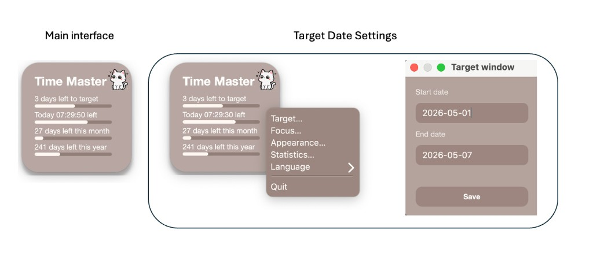
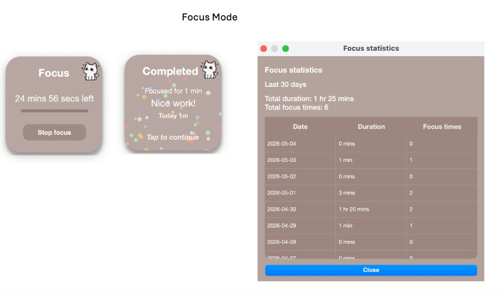

# Time Master

A small **macOS** desktop widget that stays on top of your windows: countdown to a **target date**, **today / month / year** progress, optional **Focus** sessions with a short celebration when you finish, and a **Statistics** window for the last 30 days. Interface is available in **English** and **Chinese**.

**Using the app:** [Install from a release](#install-from-github-releases-dmg-or-app) · [Product Snapshots](#product-snapshots) · [What it does](#what-it-does)

**Developing or building from source:** [Clone & run](#clone-and-run-from-source) · [Build & publish](docs/release.en.md) ([中文](docs/release.zh-CN.md)) · [Project layout](#project-layout)

---

## Product Snapshots

### Target date and menu

Right-click the card for **Target…**, **Focus…**, **Appearance…**, **Statistics…**, language, and quit. The **Target** window sets start and end dates; choose **Save** to apply.



### Focus, completion, and statistics

Start a **Focus** session from the menu; when time is up you see **Completed** with a short celebration, then continue. **Focus statistics** lists the last 30 days (duration and session counts).



---

## What it does

- Floating, always-on-top card you can drag anywhere  
- **Target date** and four progress lines (target / today / month / year)  
- **Focus** timer (minutes or hours); optional fireworks when a session completes  
- **Statistics** for recent focus time, from the right-click menu  
- **Opacity** and **language** from settings  

---

## Install from GitHub Releases (DMG or app)

For anyone who **downloads a build** (you do not need the source code).

1. Open the **`.dmg`**, drag **Time Master** into **Applications**, eject the disk image, then open the app from **Applications** or Launchpad.  
2. Your **settings and focus data** are stored here (not inside the app file):  
   `~/Library/Application Support/TimeMaster-Widget/`  
   (`time_master_config.py` and `time_master_focus_stats.json`).  
3. **First launch:** if macOS says the app is from an unidentified developer, open **System Settings → Privacy & Security** and allow it once, or **right-click the app → Open**.

---

## Clone and run from source

For **developers** who use `git clone` and run with Python (not the packaged `.app`).

**Requirements:** macOS, Python 3.10+.

In Terminal, go to the folder that contains `requirements.txt` and `time_master.py` (check with `pwd` and `ls requirements.txt`).

```bash
git clone <your-repo-url>
cd /path/to/TimeMaster-Widget   # e.g. cd ~/dev/TimeMaster-Widget
python3 -m venv .venv
source .venv/bin/activate
python3 -m pip install -r requirements.txt
cp time_master_config.example.py time_master_config.py
python3 time_master.py
```

Next time: `cd` to the project, `source .venv/bin/activate`, then `python3 time_master.py`.

### Run without keeping Terminal open (optional)

```bash
cd /path/to/TimeMaster-Widget
./start_time_master.command   # runs in background; uses .run/
./stop_time_master.command    # stop
```

Or double-click those `.command` files in Finder.

---

## Documentation

| Topic | English | 中文 |
|-------|---------|------|
| Requirements | [`docs/requirements.en.md`](docs/requirements.en.md) | [`docs/requirements.zh-CN.md`](docs/requirements.zh-CN.md) |
| Architecture | [`docs/architecture.en.md`](docs/architecture.en.md) | [`docs/architecture.zh-CN.md`](docs/architecture.zh-CN.md) |
| Build & publish (`.app` / DMG / Releases) | [`docs/release.en.md`](docs/release.en.md) | [`docs/release.zh-CN.md`](docs/release.zh-CN.md) |

Some personal paths under `docs/` (`usage.*`, `known-issues.md`, `private/`, etc.) are listed in [`.gitignore`](.gitignore) and are not part of the public repository.

---

## Local config (from source)

When running from a clone, settings live in `time_master_config.py` (not committed to Git):

```bash
cp time_master_config.example.py time_master_config.py
```

Fields include `LANGUAGE`, `WIDGET_ALPHA`, `TARGET_ISO`, `COUNTDOWN_START_ISO`, `FOCUS_DURATION_SECONDS`, `FOCUS_STARTED_ISO` — see `time_master_config.example.py`.

Focus stats: `time_master_focus_stats.json` next to the repo (ignored by Git). The **installed app** uses `~/Library/Application Support/TimeMaster-Widget/` instead.

---

## Project layout

- **`assets/`** — images and `AppIcon.icns` used at runtime.  
- **`time_master.py`** — entry point. **`tm_app.py`**, **`tm_ui.py`**, **`tm_config.py`**, **`tm_resources.py`**, **`qt_compat.py`** — app logic, widgets, config, strings/constants, Qt paths.  
- **`scripts/build_mac_app.sh`**, **`scripts/build_dmg.sh`**, **`scripts/make_app_icon.py`** — packaging and icon refresh.  
- **`docs/`** — **requirements**, **architecture**, and **release** (build / DMG / GitHub); other local doc paths are gitignored.

Built with **PySide6** on macOS; standard **pip** workflow. Do not commit `time_master_config.py` or personal statistics files.
