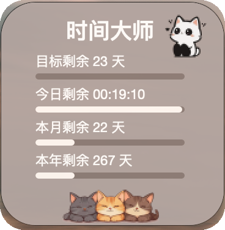
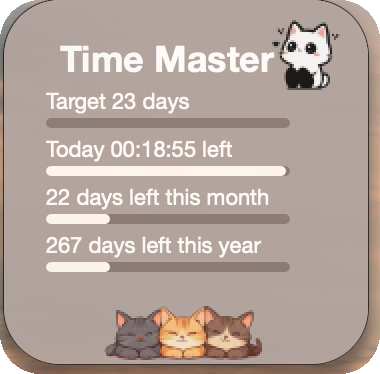

# TimeMaster-Widget

A PySide6-based floating desktop countdown widget for macOS, with bilingual UI, opacity control, custom target date, and cat-themed card styling.

## Screenshots

### Chinese



### English



## Quick Start

```bash
git clone <your-repo-url>
cd TimeMaster-Widget
python3 -m venv .venv
source .venv/bin/activate
python3 -m pip install -r requirements.txt
cp time_master_config.example.py time_master_config.py
python3 time_master.py
```

## Features

- Floating always-on-top countdown card
- Chinese and English UI
- Custom target date with persistent local config
- Opacity adjustment
- Rounded card layout with decorative cat assets

## Documentation

- Chinese requirements: `docs/requirements.zh-CN.md`
- Chinese architecture: `docs/architecture.zh-CN.md`
- Chinese usage: `docs/usage.zh-CN.md`
- English requirements: `docs/requirements.en.md`
- English architecture: `docs/architecture.en.md`
- English usage: `docs/usage.en.md`

## Requirements

- Python 3.10+
- macOS

## Install

```bash
cd TimeMaster-Widget
python3 -m venv .venv
source .venv/bin/activate
python3 -m pip install -r requirements.txt
```

## Run

```bash
cd TimeMaster-Widget
python3 time_master.py
```

## Local Config

The app stores runtime settings in a local `time_master_config.py` file, which is intentionally ignored by Git.

You can create it from the example:

```bash
cp time_master_config.example.py time_master_config.py
```

Supported fields:

- `LANGUAGE`: `"zh"` or `"en"`
- `WIDGET_ALPHA`: `0.35` to `1.00`
- `TARGET_ISO`: target datetime in ISO format
- `COUNTDOWN_START_ISO`: countdown start datetime in ISO format

## Assets

Required image assets live in `assets/` and are committed to the repository because the widget depends on them at runtime.

## Project Structure

- `time_master.py`: entry point
- `tm_app.py`: main window and app behavior
- `tm_ui.py`: UI widgets and custom drawing
- `tm_config.py`: local config loading and saving
- `tm_resources.py`: strings, colors, size constants, layout parameters
- `qt_compat.py`: local Qt import compatibility
- `docs/`: bilingual project documentation

## Notes

- The current UI is tuned for macOS desktop usage.
- The repository uses standard Python dependency management for publishing and does not require committing `.pyside6_vendor/`.
- The real local runtime config file `time_master_config.py` should not be committed.
