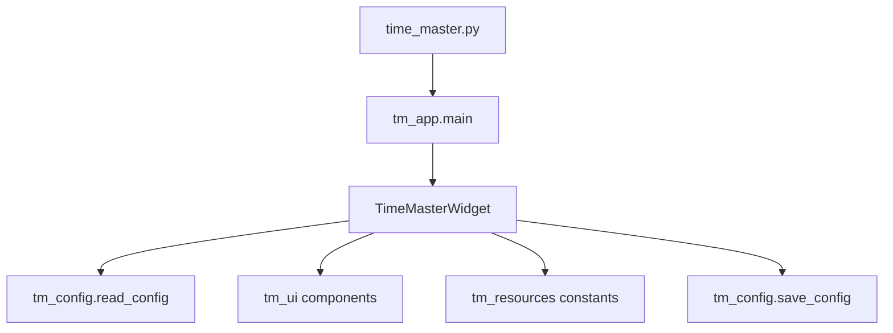

# Time Master Architecture

## 1. Current Structure

The project now uses a lightweight entry file plus a small set of focused modules. This makes the widget easier to maintain and easier to publish as a personal Git repository.

## 2. File Responsibilities

### `time_master.py`

Entry point only.

Responsibilities:

- Stay as the root launch script
- Call `tm_app.main()`
- Avoid turning back into a large mixed-responsibility file

### `tm_app.py`

Application and main-window layer.

Responsibilities:

- Build `TimeMasterWidget`
- Organize the main card layout
- Handle language switching
- Handle timer refresh logic
- Handle focus countdown and completion finalization
- Handle right-click menu behavior (including the statistics window entry)
- Handle double-click settings access
- Handle drag behavior
- Apply language-specific layout offsets

Use this file when you want to change:

- Main widget layout
- Chinese / English overall positioning
- Menu behavior
- Countdown refresh behavior

### `tm_ui.py`

UI component layer.

Responsibilities:

- `ProgressBar`: custom bar rendering
- `RowWidget`: one label + one bar
- `SettingsDialog`: settings dialog (including focus duration)
- `StatsDialog`: standalone focus statistics window
- `FireworksOverlay`: short fireworks animation layer after a completed focus session
- `CardFrame`: rounded card and decorative image painting
- `load_pixmap()`: image loading and top-edge trimming

Use this file when you want to change:

- Progress bar styling
- Row layout
- Card rendering
- Cat asset rendering
- Settings dialog styling

### `tm_config.py`

Configuration layer.

Responsibilities:

- `AppConfig` structure
- Local config read/write (`time_master_config.py`)
- Focus statistics read/write (`time_master_focus_stats.json`)
- Legacy JSON migration
- Parsing and fallback behavior for config fields
- Auto-finalize expired focus sessions on startup

Use this file when you want to change:

- Config format
- Config file location
- Default values
- Migration logic

### `tm_resources.py`

Constants and resource layer.

Responsibilities:

- Asset paths
- Size constants
- Color constants
- UI strings
- Language-specific layout offsets

Use this file when you want to change:

- Widget size
- Progress-bar width
- Colors
- UI copy
- Chinese / English offset tuning

### `qt_compat.py`

Qt compatibility layer.

Responsibilities:

- Add `.pyside6_vendor/` to `sys.path` when present
- Keep local development compatible with vendored dependencies

If the project later fully standardizes on virtualenv-based installs, this file can still remain as a compatibility shim.

## 3. Data Flow

## 4. Recommended Change Paths

### Visual changes

Suggested order:

1. `tm_resources.py`
2. `tm_ui.py`
3. `tm_app.py`

### Functional changes

Suggested order:

1. `tm_app.py`
2. `tm_config.py`
3. `tm_ui.py`

### Config changes

Suggested order:

1. `tm_config.py`
2. `README.md`
3. `time_master_config.example.py`

## 5. Maintenance Notes

- Do not move large amounts of logic back into `time_master.py`
- Keep visual constants centralized in `tm_resources.py`
- If new features are added, preserve the current separation of concerns
- Do not commit the real `time_master_config.py` file when publishing
