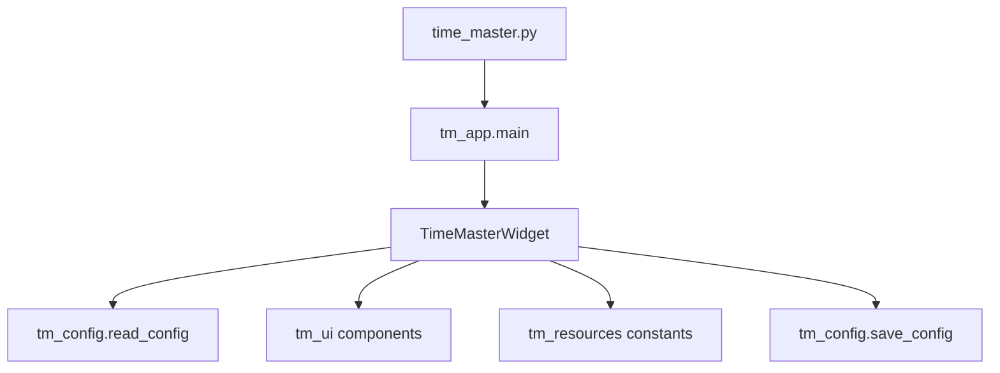

# 时间大师代码结构说明

## 1. 当前结构概览

项目当前采用“轻入口 + 模块拆分”的方式组织，便于后续维护和公开发布。

## 2. 文件职责

### `time_master.py`

项目入口文件。

职责：

- 作为启动脚本保留在仓库根目录
- 调用 `tm_app.main()`
- 保持入口足够轻，避免再次演变成大杂烩文件

### `tm_app.py`

主窗口和应用行为层。

职责：

- 创建 `TimeMasterWidget`
- 组织主卡片布局
- 控制语言切换
- 控制计时刷新
- 控制专注倒计时与完成结算
- 控制右键菜单（含统计窗口入口）
- 控制双击设置
- 控制拖动行为
- 应用语言相关布局参数

如果以后你要改：

- 主窗口布局
- 英文 / 中文整体偏移
- 菜单行为
- 刷新逻辑

优先看这个文件。

### `tm_ui.py`

UI 组件层。

职责：

- `ProgressBar`：自定义进度条绘制
- `RowWidget`：每一条文字 + 进度条组合
- `TargetDatesDialog`、`FocusOnlyDialog`、`AppearanceOnlyDialog`：目标日期区间、专注时长、透明度弹窗
- `StatsDialog`：专注统计独立窗口
- `FireworksOverlay`：专注完成后的短暂烟花动画层
- `CardFrame`：卡片背景与装饰图绘制
- `load_pixmap()`：图片加载与裁切

如果以后你要改：

- 进度条样式
- 单行排版
- 卡片背景绘制
- 猫咪图片显示方式
- 弹窗样式

优先看这个文件。

### `tm_config.py`

配置层。

职责：

- `AppConfig` 数据结构
- 本地配置读写（`time_master_config.py`）
- 专注统计读写（`time_master_focus_stats.json`）
- 旧 JSON 配置迁移
- 透明度和时间字段的解析与兜底
- 专注会话过期后的自动结算（启动时）

如果以后你要改：

- 配置保存路径
- 配置字段格式
- 默认值
- 本地配置迁移逻辑

优先看这个文件。

### `tm_resources.py`

资源与常量层。

职责：

- 资产路径
- 尺寸常量
- 颜色常量
- 中英文文案
- 语言专属布局参数

如果以后你要改：

- 卡片尺寸
- 进度条宽度
- 配色
- 文案
- 中英文偏移参数

优先看这个文件。

### `qt_compat.py`

Qt 兼容导入层。

职责：

- 在本地存在 `.pyside6_vendor/` 时补充 `sys.path`
- 兼容开发阶段的本地依赖方式

后续如果你完全改用标准虚拟环境运行，这个文件可以继续保留，作为兼容层存在，不需要频繁改动。

## 3. 数据流

## 4. 后续改动建议

### 改视觉

优先顺序：

1. `tm_resources.py`
2. `tm_ui.py`
3. `tm_app.py`

### 改功能

优先顺序：

1. `tm_app.py`
2. `tm_config.py`
3. `tm_ui.py`

### 改配置

优先顺序：

1. `tm_config.py`
2. `README.md`
3. `time_master_config.example.py`

## 5. 当前维护建议

- 不要再把大量逻辑塞回 `time_master.py`
- 视觉常量尽量集中在 `tm_resources.py`
- 若继续增加功能，优先延续现在的分层方式
- 发布到 Git 时，不提交真实的 `time_master_config.py`
